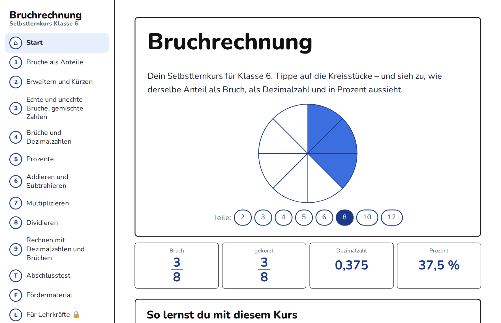

### Bruchrechentrainer – Selbstlernkurs Bruchrechnung

Interaktiver Selbstlernkurs zur Bruchrechnung für die Klassenstufe 6 – mit Erklärungen, Bildmodellen, zufällig erzeugten Übungsaufgaben, gezielter Förderdiagnose, Abschlusstest und Fördermaterial zum Ausdrucken. Läuft direkt im Browser. Keine Anmeldung, keine Installation, keine Datenspeicherung auf einem Server.

**➜ Kurs öffnen: [kliets.github.io/bruchrechentrainer](https://kliets.github.io/bruchrechentrainer/)**

### Inhalte

<table>
<tr><th>Kapitel</th><th>Thema</th><th>Kapitel</th><th>Thema</th></tr>
<tr><td align="center">1</td><td>Brüche als Anteile</td><td align="center">6</td><td>Addieren und Subtrahieren</td></tr>
<tr><td align="center">2</td><td>Erweitern und Kürzen</td><td align="center">7</td><td>Multiplizieren</td></tr>
<tr><td align="center">3</td><td>Echte und unechte Brüche, gemischte Zahlen</td><td align="center">8</td><td>Dividieren</td></tr>
<tr><td align="center">4</td><td>Brüche und Dezimalzahlen</td><td align="center">9</td><td>Rechnen mit Dezimalzahlen und Brüchen</td></tr>
<tr><td align="center">5</td><td>Prozente</td><td></td><td></td></tr>
</table>

Jedes Kapitel hat drei Teile: **Verstehen** (Merkwissen mit Bildern), **Ausprobieren** (interaktive Modelle mit Schiebereglern) und **Üben** (zufällig erzeugte Aufgaben mit Tipps und Lösungsweg).

### Features

<table>
<tr>
<td align="center" width="33%"></td>
<td align="center" width="33%"></td>
<td align="center" width="33%"></td>
</tr>
<tr>
<td align="center"><b>Ausprobieren</b></td>
<td align="center"><b>Üben</b></td>
<td align="center"><b>Abschlusstest</b></td>
</tr>
<tr>
<td align="center" width="33%"></td>
<td align="center" width="33%"></td>
<td></td>
</tr>
<tr>
<td align="center"><b>Fördermaterial</b></td>
<td align="center"><b>Auswertung für Lehrkräfte</b></td>
<td></td>
</tr>
</table>

Zum Vergrößern auf ein Bild klicken.

### Informationen für Lehrkräfte

- **Einsatz:** Den Kurs-Link in itslearning (oder einer anderen Lernplattform) als Link einstellen, Option „in neuem Fenster öffnen“.
- **Test mit Abgabe:** Im Bereich „Für Lehrkräfte“ einen Test-Link erzeugen (namentlich oder anonym), in einer itslearning-Aufgabe mit Abgabe bereitstellen, die abgegebenen Ergebnisdateien anschließend im Kurs auswerten.
- **Arbeitsblätter und Lösungen:** Papierversion aller Übungen und des Abschlusstests (Gruppe A und B), Schülerfassung und Lösungen getrennt.
- Der Lehrkräftebereich ist **passwortgeschützt**. Das Passwort ist nicht öffentlich und kann über den Autor erfragt werden.

**Anleitungen:**
- [Schnellstart für Lehrkräfte (1 Seite, PDF)](anleitung/Schnellstart-Lehrkraefte.pdf) 
- [Ausführliche Anleitung für Lehrkräfte (PDF)](anleitung/Anleitung-Lehrkraefte.pdf) 

### Datenschutz

- Der Kurs speichert nichts auf einem Server und setzt keine Cookies. Schriften sind eingebettet, es werden keine externen Dienste geladen.
- Namen, Antworten und Punkte der Kinder werden **nie** an GitHub oder einen anderen Dienst übertragen. Die Ergebnisdatei entsteht auf dem Gerät des Kindes, ist verschlüsselt und gelangt nur über die Abgabe in der Lernplattform zur Lehrkraft.
- Die Auswertung läuft ausschließlich im Browser der Lehrkraft und wird nicht gespeichert.
- Lösungen und Arbeitsblätter sind verschlüsselt eingebettet und nur mit dem Lehrkräfte-Passwort zu öffnen.

## Fachlicher Bezug

Orientiert an den **Fachanforderungen Mathematik Sekundarstufe I, Schleswig-Holstein (2024)**, Leitidee *Zahl und Operation*, Jahrgangsstufe 5/6:

- Bruchzahlen als Anteile, Größen und Operatoren; Erweitern und Kürzen – durchgehend **schrittweises Kürzen** statt ggT-Bestimmung
- Abbrechende und einfache periodische Dezimalbrüche, Stellenwerttafel
- Prozentsatz und Prozentstreifen, Prozentwerte als Anwendung der Bruchteilberechnung
- Grundrechenarten mit Brüchen (die Division von Brüchen ist für die Anforderungsebene ESA nicht erforderlich)

**Hinweis: Der Lernfortschritt bleibt erhalten, solange die Seite geöffnet ist. Beim Neuladen beginnt der Kurs von vorn.**
