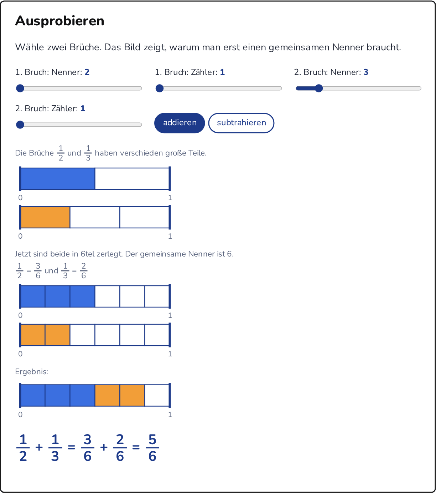
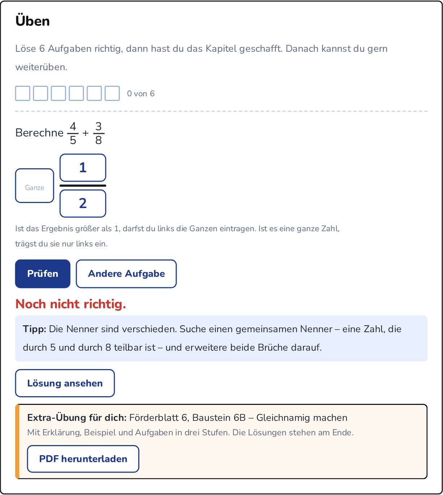
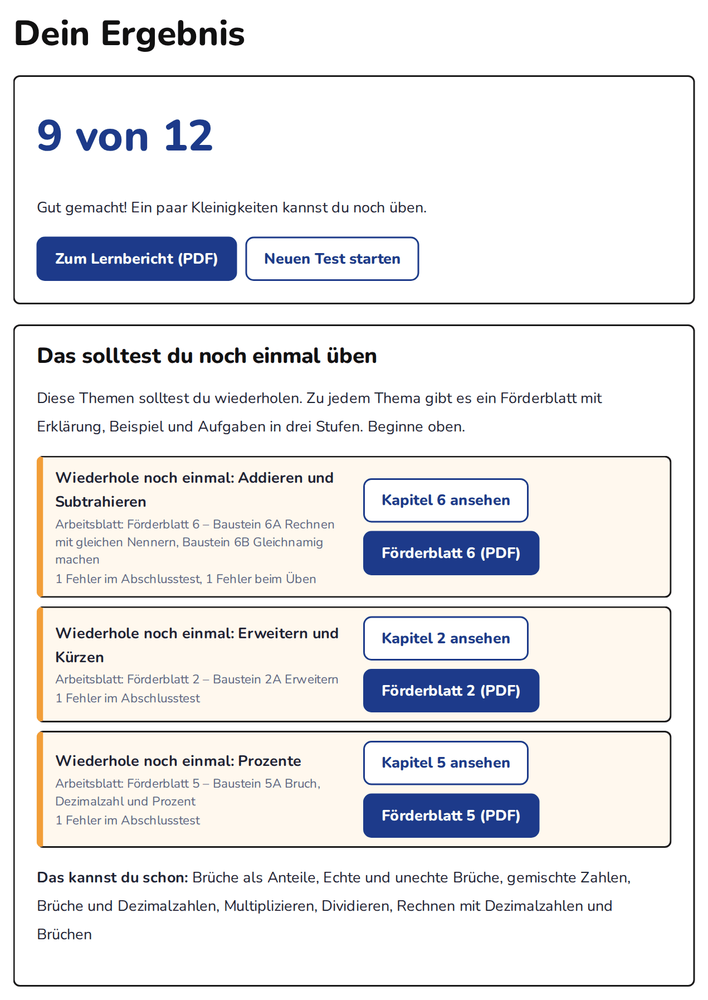
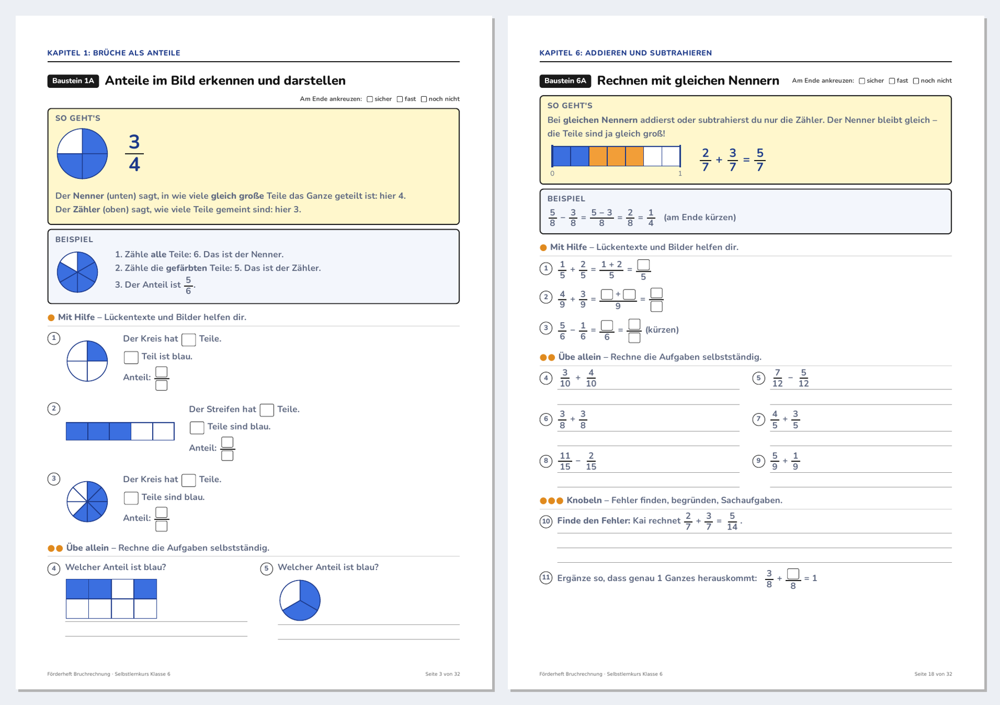
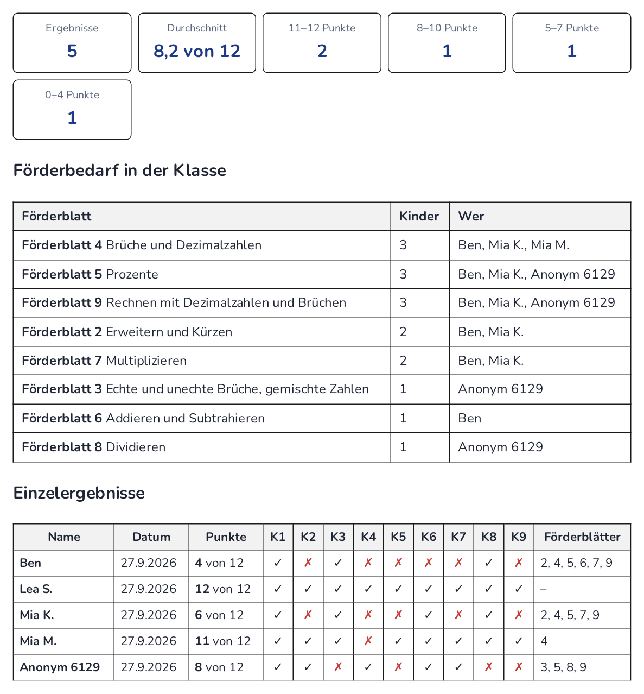

## Bruchrechentrainer – Selbstlernkurs Bruchrechnung

Interaktiver Selbstlernkurs zur Bruchrechnung für die Klassenstufe 6 – mit Erklärungen, Bildmodellen, zufällig erzeugten Übungsaufgaben, gezielter Förderdiagnose, Abschlusstest und Fördermaterial zum Ausdrucken.

**➜ Kurs öffnen: [kliets.github.io/bruchrechentrainer](https://kliets.github.io/bruchrechentrainer/)**

Läuft direkt im Browser. Keine Anmeldung, keine Installation, keine Datenspeicherung auf einem Server.

## Inhalte

| Kapitel | Thema |
|---|---|
| 1 | Brüche als Anteile |
| 2 | Erweitern und Kürzen |
| 3 | Echte und unechte Brüche, gemischte Zahlen |
| 4 | Brüche und Dezimalzahlen |
| 5 | Prozente |
| 6 | Addieren und Subtrahieren |
| 7 | Multiplizieren |
| 8 | Dividieren |
| 9 | Rechnen mit Dezimalzahlen und Brüchen |

Jedes Kapitel hat drei Teile: **Verstehen** (Merkwissen mit Bildern), **Ausprobieren** (interaktive Modelle mit Schiebereglern) und **Üben** (zufällig erzeugte Aufgaben mit Tipps und Lösungsweg).

## Eindrücke aus dem Programm

**Ausprobieren** – Bildmodelle machen sichtbar, warum man zum Addieren einen gemeinsamen Nenner braucht.

**Üben** – Brüche werden wie im Heft eingegeben: Zähler oben, Nenner unten. Typische Fehler (hier: Nenner addiert) erkennt der Kurs und schlägt das passende Förderblatt vor.

**Abschlusstest** – 12 Aufgaben aus allen Kapiteln. Danach sehen die Kinder, was sie noch einmal üben sollten, und können einen Lernbericht als PDF herunterladen.

**Fördermaterial** – 20 Förderbausteine als Förderheft und 9 Förderblätter (PDF): jeweils „So geht's“, ein Beispiel und Aufgaben in drei Stufen (● Mit Hilfe, ●● Übe allein, ●●● Knobeln), Lösungen zur Selbstkontrolle.

**Auswertung für Lehrkräfte** – Über einen Test-Link geben die Kinder eine verschlüsselte Ergebnisdatei in itslearning ab. Im Lehrkräftebereich entsteht daraus eine Klassenübersicht: Punkte, Förderbedarf pro Förderblatt mit Namen, Export als Excel-Tabelle.

## Für Lehrkräfte

- **Einsatz:** Den Kurs-Link in itslearning (oder einer anderen Lernplattform) als Link einstellen, Option „in neuem Fenster öffnen“.
- **Test mit Abgabe:** Im Bereich „Für Lehrkräfte“ einen Test-Link erzeugen (namentlich oder anonym), in einer itslearning-Aufgabe mit Abgabe bereitstellen, die abgegebenen Ergebnisdateien anschließend im Kurs auswerten.
- **Arbeitsblätter und Lösungen:** Papierversion aller Übungen und des Abschlusstests (Gruppe A und B), Schülerfassung und Lösungen getrennt.
- Der Lehrkräftebereich ist **passwortgeschützt**. Das Passwort und eine ausführliche Anleitung erhalten Lehrkräfte auf Anfrage.

## Datenschutz

- Der Kurs speichert nichts auf einem Server und setzt keine Cookies. Schriften sind eingebettet, es werden keine externen Dienste geladen.
- Namen, Antworten und Punkte der Kinder werden **nie** an GitHub oder einen anderen Dienst übertragen. Die Ergebnisdatei entsteht auf dem Gerät des Kindes, ist verschlüsselt und gelangt nur über die Abgabe in der Lernplattform zur Lehrkraft.
- Die Auswertung läuft ausschließlich im Browser der Lehrkraft und wird nicht gespeichert.
- Lösungen und Arbeitsblätter sind verschlüsselt eingebettet und nur mit dem Lehrkräfte-Passwort zu öffnen.

## Fachlicher Bezug

Orientiert an den **Fachanforderungen Mathematik Sekundarstufe I, Schleswig-Holstein (2024)**, Leitidee *Zahl und Operation*, Jahrgangsstufe 5/6:

- Bruchzahlen als Anteile, Größen und Operatoren; Erweitern und Kürzen – durchgehend **schrittweises Kürzen** statt ggT-Bestimmung
- Abbrechende und einfache periodische Dezimalbrüche, Stellenwerttafel
- Prozentsatz und Prozentstreifen, Prozentwerte als Anwendung der Bruchteilberechnung
- Grundrechenarten mit Brüchen (die Division von Brüchen ist für die Anforderungsebene ESA nicht erforderlich)

## Technik

Der gesamte Kurs ist **eine einzige Datei** (`index.html`) mit eingebetteten Schriften, Bildern und PDFs. Sie funktioniert auch offline, wenn man sie herunterlädt und im Browser öffnet. Veröffentlicht über GitHub Pages.

Hinweis: Der Lernfortschritt bleibt erhalten, solange die Seite geöffnet ist. Beim Neuladen beginnt der Kurs von vorn.
